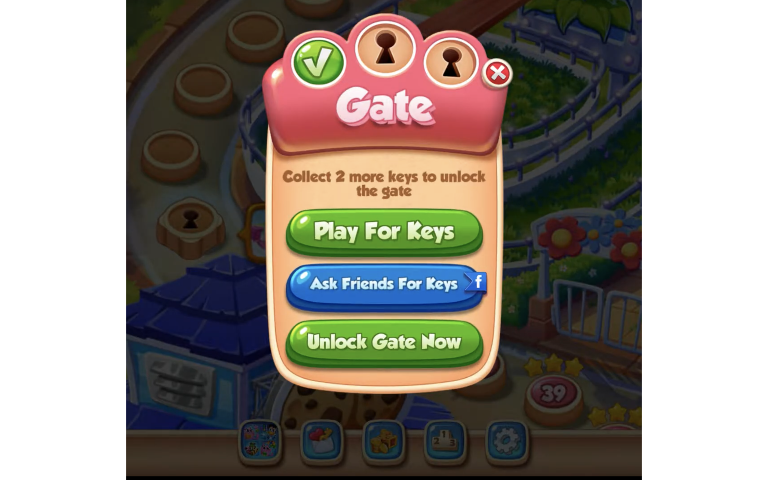
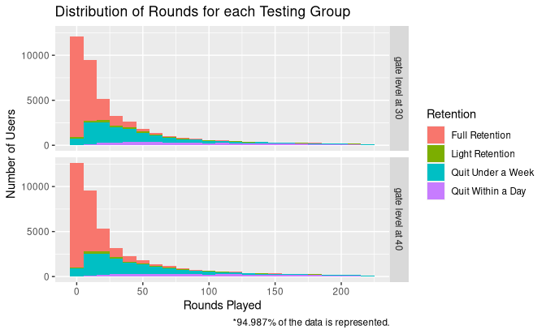

## Control  
Currently a gate level is presented to the player when they reach level thirty. These levels give the player three ways of proceeding: replaying previous levels, inviting friends to download the app, or purchasing the keys to open the gate instantly.  
  

## Alternative Placement  
Despite gate levels encouraging the player to invite more users or purchase content, they also can negatively impact player retention rates. To measure the magnitude of this possible negative impact we designed an A/B test. The control group encounter a gate level where it has been, level thirty, and the other half encounter one at level forty.

## Observations  

We observed 90189 users that were randomly assigned either version of the game. One observation of the gate level at 30 was removed for being an outlier (over 49 thousand rounds attempted within the 14 days). As a KPI of user retention rate, we checked for activity on the first and seventh day after install. Below are two graphs depicting the distribution of the number of rounds played for both versions; color is added to depict retention rates.

